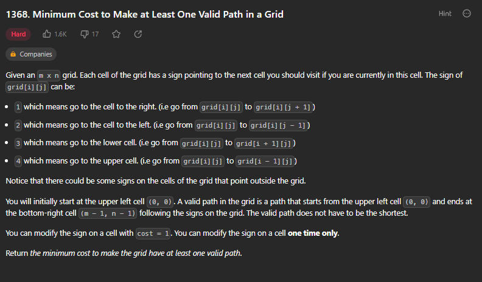
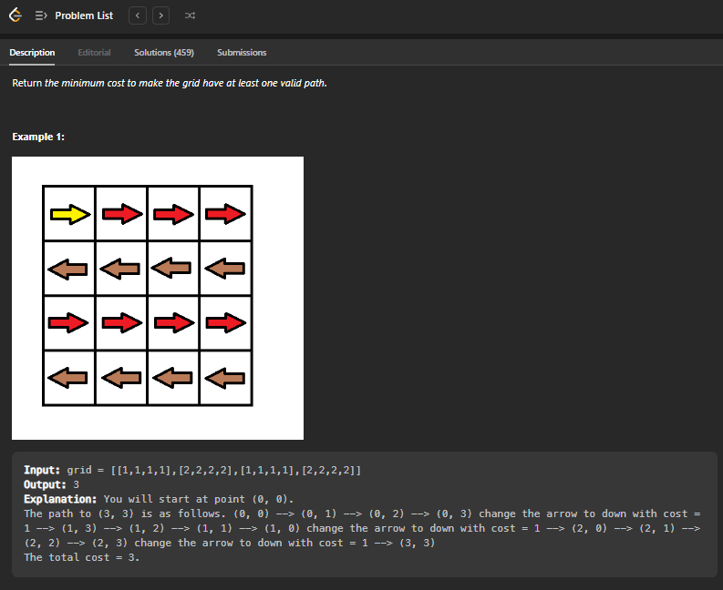

# Página de acesso ao exercício
[Minimum Cost to Make at Least One Valid Path in a Grid](https://leetcode.com/problems/minimum-cost-to-make-at-least-one-valid-path-in-a-grid/description/) 
# Explicação

# Exemplo

