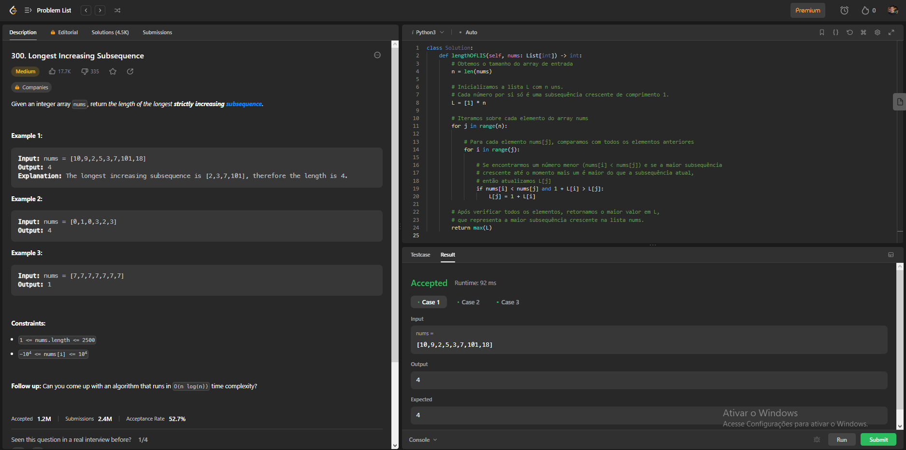

# Exercícios Leet Code

**Número da Lista**: 1 
**Conteúdo da Disciplina**: Programação Dinâmica 

## Alunos
|Matrícula | Aluno |
| -- | -- |
| 20/0018248  |  [Gabriel Roger Amorim da Cruz](https://github.com/GabrielRoger07) |
| 20/0020650  |  [João Pedro de Camargo Vaz](https://github.com/JoaoPedro0803) |

## Sobre 
Esse projeto tem por objetivo a resolução de questões encontradas no leet code, com o intuito de mostrar o nosso aprendizado no módulo de Programação Dinâmica, da disciplina Projetos de Algoritmos, do professor Maurício Serrano.

## Screenshots
### Exercício 1 (Médio) - [Unique Paths](https://leetcode.com/problems/unique-paths/description/)
[**Código**](https://github.com/projeto-de-algoritmos/PD_Exercicios_LeetCode/blob/master/UniquePaths/unique.py) 

### Exercício 2 (Médio) - [Longest Increasing Subsequence](https://leetcode.com/problems/longest-increasing-subsequence/description/)
[**Código**](https://github.com/projeto-de-algoritmos/PD_Exercicios_LeetCode/blob/master/MaiorSubsequenciaCres/maiorSubseqCres.py) 

### Exercício 3 (Difícil) - [Minimum Cost to Make at Least One Valid Path in a Grid](https://leetcode.com/problems/minimum-cost-to-make-at-least-one-valid-path-in-a-grid/description/)
[**Código**](https://github.com/projeto-de-algoritmos/PD_Exercicios_LeetCode/blob/master/MinimumCost/MinCost.py) 

### Exercício 4 (Médio) - [Network Delay Time](https://leetcode.com/problems/network-delay-time/description/)
[**Código**](https://github.com/projeto-de-algoritmos/PD_Exercicios_LeetCode/blob/master/NetworkDelayTime/networkDelayTime.py) 

### Exercício 5 (Médio) - [Number of Longest Increasing Subsequence](https://leetcode.com/problems/number-of-longest-increasing-subsequence/description/)
[**Código**](https://github.com/projeto-de-algoritmos/PD_Exercicios_LeetCode/blob/master/LongestIncreasingSubsequence/longestIncreasingSubsequence.py) 

### Exercício 6 (Difícil) - 
[**Código**]() 

### Vídeo de Apresentação
[Link para o Vídeo de Apresentação da Dupla 1 - YouTube]()

## Instalação 
**Linguagem**: Python 
**Pré-Requisitos**: Os códigos devem ser rodados na própria plataforma do leetcode, tendo em vista o uso de uma classe Solution, bem como o uso correto dos inputs por parte da plataforma.

## Uso 
### Passo 1: Copiar o código
Entre na pasta do exercício específico, clique no arquivo `.py` e copie-o.

### Passo 2: Entrar na página do exercício
Ao clicar no título de cada questão presente neste README, você será redirecionado para a página da questão na plataforma LeetCode

### Passo 3: Alterar linguagem 
Selecione a linguagem `Python3`.

### Passo 4: Colar o código
Cole o código copiado no editor.

### Passo 5: Rodar o código
Abaixo do editor de código, clique em `Run` para executar o código.

